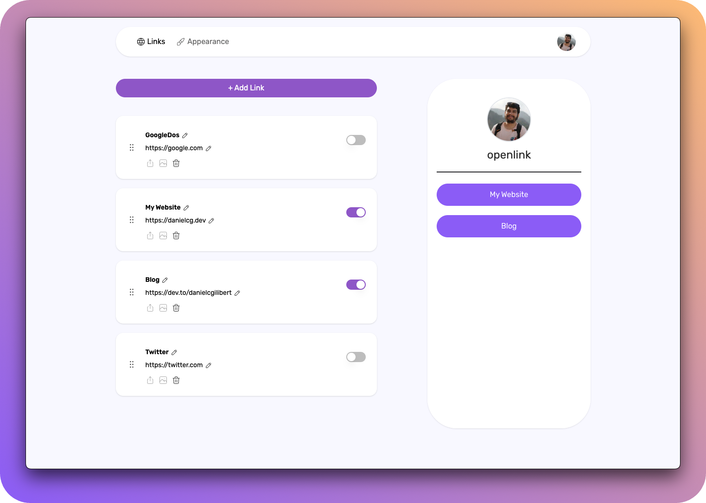

<div align="center">



 🚧 This project is under development 🚧

</div>

## ⚙️ Stack

- [**Next.js 13 /app directory** + **Typescript**](https://nextjs.org/) - The React Framework.
- [**Tailwind CSS** + **Tailwind-Merge** + **clsx**](https://tailwindcss.com/) - Tailwind CSS is a utility-first CSS framework.
- [**Headless UI**](https://headlessui.com/) - Completely unstyled, fully accessible UI components.
- [**Tabler Icons**](https://tabler-icons.io/i/) - A open source SVG icons.
- [**React Hot Toast**](https://react-hot-toast.com/) - Notifications library.
- [**Zustand**](https://zustand-demo.pmnd.rs/) - State management in React.
- [**Next Auth**](https://next-auth.js.org/) - Authentication for Next.js.
- [**Prisma**](https://www.prisma.io/) - ORM for Node.js & TypeScript.
- [**React Spring**](https://www.react-spring.dev/) - The animation lib React Spring.
- [**TanStack Query**](https://tanstack.com/query/latest) - TanStack Query powerful asynchronous state management.
- [**Docker**](https://www.docker.com/) - Development environment.

## 🛣️ Roadmap

- ❌ Dark mode

## ✏️ Prerequisites

Make sure you have Docker and Docker Compose installed on your machine before proceeding.

- [Nodejs +16 (LTS recommended)](https://nodejs.org/en/)
- [Docker](https://www.docker.com/get-started)
- [Docker Compose](https://docs.docker.com/compose/install/)

## 📦 Environment Variables

Change the file .env.template to .env.development :

```env
# Database connection string:
DATABASE_URL=""

# Next-Auth config:
NEXTAUTH_SECRET="" # Generate a random string.
NEXTAUTH_URL="" # Your project url http://localhost:3000.

# Google OAuth Provider:
GOOGLE_CLIENT_ID=""
GOOGLE_CLIENT_SECRET=""
```

## 🚀 Getting Started

**Recommended extensions for VSCode:**

- [Tailwind CSS IntelliSense](https://marketplace.visualstudio.com/items?itemName=bradlc.vscode-tailwindcss).
- [Prettier - Code formatter](https://marketplace.visualstudio.com/items?itemName=esbenp.prettier-vscode).
- [ESLint](https://marketplace.visualstudio.com/items?itemName=dbaeumer.vscode-eslint).

1. Clone or [fork](https://github.com/danielcgilibert/OpenLink/fork) the repository:

```bash
git@github.com:danielcgilibert/OpenLink.git
```

2. Install dependencies:

```bash
npm install
# or
yarn install
# or
pnpm install
```

3. Run the following command to start the database:

```bash
docker-compose up
```

4. Run the development server:

```bash
npm run dev
# or
yarn dev
# or
pnpm dev
```

## ☁ Deploys

- [Vercel](https://vercel.com/)
- [PlanetScale](https://planetscale.com/)

## 🔑 License

- [MIT](https://github.com/danielcgilibert/OpenLink/blob/main/LICENSE).
